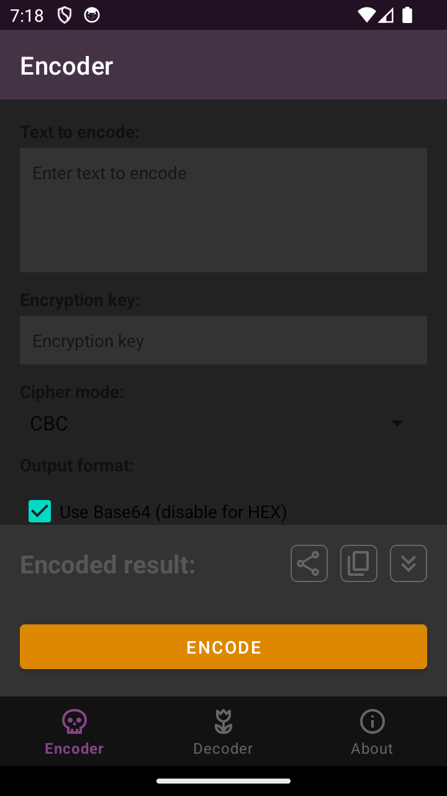
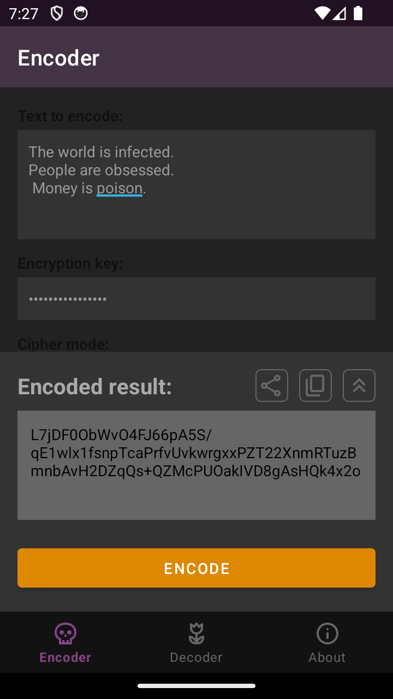

# 🇷🇺 Русский • [🇬🇧 English](README.en.md)

# Enigma

🛡 **Enigma** — криптографический инструмент для Android, чтобы **шифровать и расшифровывать текст**, используя алгоритм **Blowfish**.

---

## ✨ Возможности

- 🔒 **Шифрование и дешифрование текста**
- ⚙️ Поддержка **режимов**: ECB, CBC
- 🔁 **Base64** или **HEX** выходной формат
- 🔐 **IV (Initialization Vector)**: ручной ввод или авто-встраивание
- 📋 Копирование и отправка результата в другие приложения

---

## 📸 Скриншоты

  
  
  

---

## 🚀 Установка

📦 **APK релиз** (ручная установка):
- Скачать из [релизов](https://github.com/rokkystudio/enigma/releases)

---

## ⚠️ Политика конфиденциальности

- Приложение **не подключается к интернету**
- Приложение **не собирает и не отправляет данные**
- Приложение **не содержит рекламы**
- Приложение полностью **работает в оффлайне**

---

## 🛡 Лицензия

Этот проект лицензирован по условиям [Creative Commons Attribution-NonCommercial 4.0 International (CC BY-NC 4.0)](LICENSE).
✅ Бесплатно для личного, образовательного и некоммерческого использования
❌ Коммерческое использование, реклама и использование организациями запрещены
